# Release Workflow Diagram

```mermaid
graph TD
    A[Open PR to main or stage]
    A --> B[Run CI]
    B --> C[Lint and build]
    C --> D[Unit tests]
    D --> E[E2E tests]
    E --> F[PR approved and merged]

    F --> G[Push to main or stage]
    G --> H[Release job]
    H --> I[Checkout]
    I --> J[Setup Node 20]
    J --> K[Install deps]
    K --> L[Build npm run compile]
    L --> M[Semantic release]
    M --> M2[Publish package to npm]

    M2 --> N{Branch is main}
    N -->|No| O[End]
    N -->|Yes| P[Sync stage job]
    P --> Q[Checkout]
    Q --> R[Configure Git]
    R --> S[Fetch and pull main]
    S --> T[Checkout stage]
    T --> U[Merge main into stage]
    U --> V[Push stage]

    style A fill:#0d47a1,stroke:#0b3c87,stroke-width:1px,color:#ffffff
    style B fill:#1565c0,stroke:#0d47a1,stroke-width:1px,color:#ffffff
    style C fill:#1565c0,stroke:#0d47a1,stroke-width:1px,color:#ffffff
    style D fill:#1565c0,stroke:#0d47a1,stroke-width:1px,color:#ffffff
    style E fill:#1565c0,stroke:#0d47a1,stroke-width:1px,color:#ffffff
    style F fill:#1976d2,stroke:#0d47a1,stroke-width:1px,color:#ffffff

    style G fill:#1b5e20,stroke:#0d3a12,stroke-width:1px,color:#ffffff
    style H fill:#2e7d32,stroke:#1b5e20,stroke-width:1px,color:#ffffff
    style I fill:#2e7d32,stroke:#1b5e20,stroke-width:1px,color:#ffffff
    style J fill:#2e7d32,stroke:#1b5e20,stroke-width:1px,color:#ffffff
    style K fill:#2e7d32,stroke:#1b5e20,stroke-width:1px,color:#ffffff
    style L fill:#2e7d32,stroke:#1b5e20,stroke-width:1px,color:#ffffff
    style M fill:#388e3c,stroke:#1b5e20,stroke-width:1px,color:#ffffff
    style M2 fill:#004d40,stroke:#00251a,stroke-width:1px,color:#ffffff

    style N fill:#e65100,stroke:#bf360c,stroke-width:1px,color:#ffffff
    style O fill:#424242,stroke:#212121,stroke-width:1px,color:#ffffff
    style P fill:#f9a825,stroke:#f57f17,stroke-width:1px,color:#000000
    style Q fill:#f9a825,stroke:#f57f17,stroke-width:1px,color:#000000
    style R fill:#f9a825,stroke:#f57f17,stroke-width:1px,color:#000000
    style S fill:#f9a825,stroke:#f57f17,stroke-width:1px,color:#000000
    style T fill:#f9a825,stroke:#f57f17,stroke-width:1px,color:#000000
    style U fill:#f9a825,stroke:#f57f17,stroke-width:1px,color:#000000
    style V fill:#f9a825,stroke:#f57f17,stroke-width:1px,color:#000000
```

## Description

This GitHub Actions workflow automates the CI and release process for the project.

- **Trigger conditions**

  - CI (`ci.yml`) runs on pull requests targeting `main` or `stage`.
  - Release (`release.yml`) runs on every `push` to the `main` or `stage` branches.

- **Release flow (simplified)**

  - Checkout code and configure Node.js 20.
  - Install dependencies and build the project (`npm run compile`).
  - Run `semantic-release` to determine the next version and generate release artifacts.
  - **Publish the package to the npm registry** using the configured npm token.
  - If the push is on `main`, run the `sync-stage` job to merge `main` into `stage` and push the updated `stage` branch.

- **Release job** (runs on every push to `main` or `stage`)

  - **Checkout** the repository with full history (`fetch-depth: 0`) using the `CUSTOM_GITHUB_TOKEN`.
  - **Setup Node.js** version 20 and enable npm cache for faster installs.
  - **Install dependencies** using `npm install`.
  - **Build the project** by running `npm run compile`.
  - **Publish a release** using `npx semantic-release`, authenticated with `CUSTOM_GITHUB_TOKEN` and `NPM_TOKEN`.

- **Sync-stage job** (runs only when the push is to `main`)
  - Declared with `needs: release`, so it runs only if the `release` job completes successfully.
  - Additionally guarded by `if: github.ref == 'refs/heads/main'`, so it is skipped for pushes to `stage`.
  - **Checkout** the repository with full history using `CUSTOM_GITHUB_TOKEN`.
  - **Configure Git** user name and email for automated commits.
  - **Synchronize branches** by merging `main` into `stage`:
    - Fetch latest changes from `origin`.
    - Pull the latest `main` branch.
    - Check out the `stage` branch.
    - Merge `main` into `stage` with a predefined commit message (including `[skip ci]`) and conflict strategy `-Xtheirs`.
    - Push the updated `stage` branch back to `origin`.
